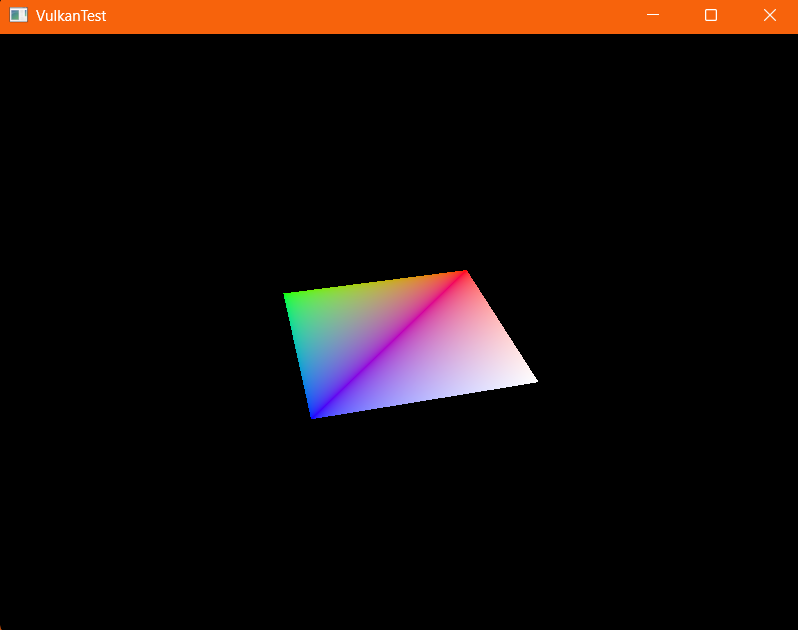

Learning how to use Vulkan one step at a time.

"Even the smallest step's a leap toward your dream" Linus from the Stars - It's Alright, It's Okay

The goal with the build process was to easily build on other systems as well as have a portable binary.

Build steps after environment is set up:
- open mingw64.exe and navigate to the build folder, then run these commands
- rm -rf CMakeCache.txt CMakeFiles VulkanTest.exe
- cmake .. -G "MinGW Makefiles" -DCMAKE_C_COMPILER=C:/msys64/mingw64/bin/gcc.exe     -DCMAKE_CXX_COMPILER=C:/msys64/mingw64/bin/g++.exe
- mingw32-make

Big thanks to: 
https://vulkan-tutorial.com/
Brendan Galea https://www.youtube.com/watch?v=lr93-_cC8v4

Check out this square! We're on to 3D!

Topics explored so far:
- Basic program setup - initialize, main loop, cleanup, window setup with GLFW, intro to Vulkan
- Vulkan instance - create a basic instance of Vulkan with extensions from GLFW
- GLFW extensions - more extension options and info about extension support
- Validation layers - how to get debug output when things go wrong using layers built in to the Vulkan SDK
- Physical devices - find GPUs and check their computing and Vulkan support capabilities, then pick one to use
- Queue families - check device support for different command subsets
- Logical devices - set up the interface for interacting with the chosen physical device
- WSI & surfaces - Windows System Integration extensions - present rendered images
- Swap chain - setup of swap chain surfaces, access to swap chain elements, and prepping for drawing
- Graphics pipeline - graphics pipeline elements and shaders and how it works in Vulkan
- GLSL - GLSL basics for vertex and fragment shaders and how to use them with Vulkan
- Viewports and scissors - region of the frame buffer to render output to
- Rasterizer - convert geometry into fragments
- Color blending - alpha blending of fragment shader return value and existing color in the frame buffer
- Render passes - single subpass render pass in preparation for drawing a single triangle
- Swap chain, drawing, and framebuffers - setting up swap chain swap chain framebuffers for drawing
- Command buffers - begin render pass and fill drawing space with black, bind the pipeline we want to render with, and dynamically define viewport and scissor state
- Semaphores & fences - synchronize execution on GPU and CPU
- Multiple frames in flight and using staging buffers
- Vertex and index buffers - save space by removing redundant vertices
